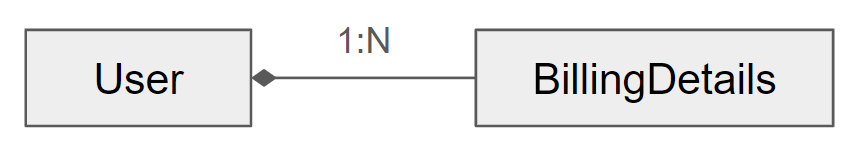
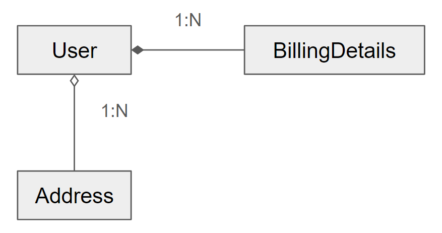
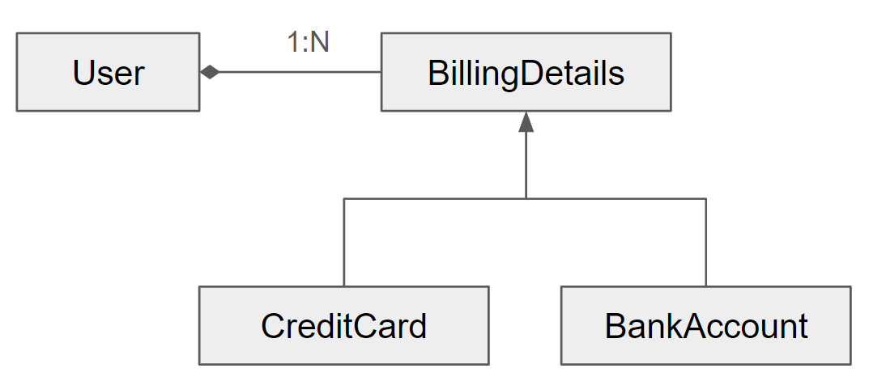
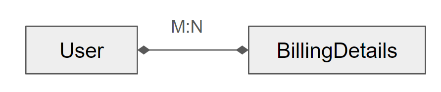

# 01. 객체/관계형 영속성 이해
* 1.1 영속성이란?
  - 객체 영속성(object persistence)
    - 개별 객체가 애플리케이션 프로세스보다 오래 유지될 수 있음을 의미
    - SQL을 사용해 데이터베이스의 객체 인스턴스를 매핑하고 데이터베이스에 저장하는 것
  * 1.1.1 관계형 데이터베이스
    - 데이터 독립성(data independence)
      - 관계형 DBMS는 자바에만 국한되지 않음
      - SQL 데이터베이스도 특정 애플리케이션에만 국한되지 않음
      - 데이터는 일반적으로 애플리케이션보다 수명이 김
  * 1.1.2 SQL 이해
    - 데이터 정의 언어(data definition language; DDL)
      - DBMS에서 테이블이나 제약조건을 생성,변경,삭제하기 위한 구문을 갖추고 있음
    - 데이터 조작 언어(data manipulation language; DML)
      - 삽입, 업데이트, 삭제 등 데이터에 대한 연산 수행
    - 데이터 질의 언어(data query language; DQL)
      - 제한(restriction), 프로젝션(projection), 카테시안 곱(Cartesian product)를 통해 데이터 조회
      - 조인(join), 집계(aggregate), 그룹화(group), 서브쿼리(subselect) 사용 가능
    - 데이터 제어 언어(data control language; DCL)
      - 데이터베이스 접근 권한 제어
  * 1.1.3 자바에서의 SQL 사용
    - JDBC API를 통해 데이터베이스에 SQL문 전달
* 1.2 페러다임의 불일치
  - 
    ```
    CREATE TABLE USERS (
      USERNAME VARCHAR(15) NOT NULL PRIMARY KEY,
      ADDRESS VARCHAR(255) NOT NULL
    ); 
    ```
  * 1.2.1 세분성 문제
    - 여러 개의 칼럼을 추가할지 또는 새로운 SQL 데이터 타입의 칼럼 하나를 추가할지 선택하는 것
    - 
    ```
    CREATE TABLE USERS (
      USERNAME VARCHAR(15) NOT NULL PRIMARY KEY,
      ADDRESS ADDRESS NOT NULL
    );
    ```
      - 사용자 정의 데이터 타입(user-defined data type:UDT) 지원 안함
    - 아래와 같은 표현이 일반적
      ```
      CREATE TABLE USERS (
        ID BIGINT NOT NULL PRIMARY KEY,
        USERNAME VARCHAR(15) NOT NULL UNIQUE,
        ADDRESS_STREET VARCHAR(255) NOT NULL,
        ADDRESS_ZIPCODE VARCHAR(5) NOT NULL,
        ADDRESS_CITY VARCHAR(255) NOT NULL
      );
      ```
  * 1.2.2 상속 문제
    - 모델의 상속 구조를 상속 메커니즘을 제공하지 않는 SQL 데이터베이스에 영속화 해야함
    - 
  * 1.2.3 동일성 문제
    - 인스턴스 동일성(identity)
      - 메모리 주소 비교로 확인
      - ex> a==b
    - 인스턴스 동등성(equality)
      - `equals()` 메서드의 구현에 의해 결정됨
      - 자연키(natural key), 대리키(surrogate key) 사용
  * 1.2.4 연관관계 문제
   - 객체지향 언어에서는 객체 참조(object reference)를 사용해 연관관계를 나타냄
   - 관계형 세계에서는 외래키 제약조건 칼럼이 키 값의 복사본을 통해 연관관계를 나타냄
     - 다대다(many-to-many) 다중성
     - 
     - SQL 데이터베이스에서 다대다 연관관계를 표현하려면 링크 테이블(link table) 도입
       ``` 
       CREATE TABLE USER_BILLINGDETAILS (
         USER_ID BIGINT,
         BILLINGDETAILS_ID BIGINT,
         PRIMARY KEY (USER_ID, BILLINGDETAILS_ID),
         FOREIGN KEY (USER_ID) REFERENCES USERS(ID),
         FOREIGN KEY (BILLINGDETAILS_ID) REFERENCES BILLINGDETAILS(ID)
       );
       ```
  * 1.2.5 데이터 탐색 문제
    - 데이터베이스에 대한 요청 횟수를 최소화 해야함
      - SQL 쿼리수 최소화
    - 카타시안 곱 문제
      - 메모리 낭비
    - `n+1` 문제
      - ex> User를 조회하기 위해 한번의 조회와 BillingDetails인스턴스 n번의 조회 필요
* 1.3 ORM, JPA, 하이버네이트, 스프링 데이터
  - 객체/관계형 매핑(ORM)
    - 애플리케이션의 클래스와 SQL 데이터베이스의 스키마 간의 매핑을 설명하는 메타데이터를 사용해 자바 애플리케이션의 객체를 RDBMS의 테이블에 자동으로 영속화하는 기술
  - JPA(Jakarta Persistence API)
    - 객체 및 객체/관계형 매핑의 영속성을 관리하는 API를 정의한 명세
    - 하이버네이트는 가장 널리 사용되는 구현체
    - Sping Data JPA는 JPA 구현(하이버네이트) 위에 추가 레이어를 제공
  - JPA 명세
    - 영속성 클래스 및 프로퍼티가 데이터베이스 스키마와 어떻게 관련돼 있는지 지정하는 매핑 메타데이터
      - 도메인 모델 클래스의 자바 애너테이션에 의존하지만 XML 파일에 매핑 정보를 작성할 수도 있음
    - 영속성 클래스의 인스턴스를 대상으로 기본적인 CRUD 작업을 수행하기 위한 API
      - ex> `javax.persistence.EntityManager`
    - 클래스 및 프로퍼티를 참조하는 쿼리를 지정하기 위한 언와와 API
      - 이 언어를 JPQL(Jakarta Persistence Query Language)이라 함
      - 프로그래밍 방식으로 기준 쿼리를 생성할 수 있음
    - 영속성 엔진이 트랜잭션 방식으로 동작하는 인스턴스와 상호작용해 변경 감지, 연관관계 페치, 최적화 기능 수행
      - 캐싱전략
  - 하이버네이트의 이점
    - 생산성
      - 비지니스 문제에 집중
    - 유지보수 용이성
      - 코드 수 줄임
      - 도메인 모델과 SQL 스키마 사이 완충지대 제공
    - 성능
      - 캐싱 제공
    - 공급자 동립성
      - DBMS 이식성 확보
  - Spring Data의 이점
    - 공유 인프라
      - 스프링 데이터 커먼즈는 자바 클래스를 영속화하기 위한 메타데이터 모델과 기술 중립적인 리포지터리(repository) 인터페이스를 제공
    - DAO 구현 제거
      - JPA 구현은 데이터 접근 객체(data access object; DAO) 패턴 사용
      - 데이터베이스의 세부 사항을 숨기면서 애플리케이션 호출을 영속성 계층에 매핑
    - 자동 클래스 생성
      - JpaRepository를 확장하여 구현을 자동으로 생성
    - 메서드에 대한 기본 구현
      - 기본 CRUD 작업은 더 이상 구현할 필요가 없음
    - 생성된 쿼리
      - 명명 패턴에 따라 리포지터리 인터페이스에서 메서드를 정의할 수 있음
    - 필요한 경우 데이터베이스에 접근