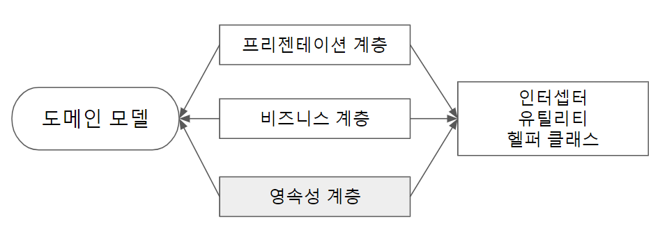
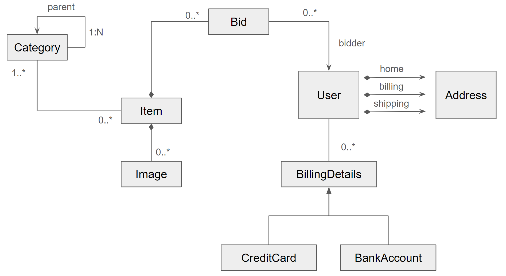

# 03. 도메인 모델과 메타데이터
* 3.1 CaveatEmptor 예제 애플리케이션
  - 3.1.1 계층형 아키텍처
    - 
  - 3.1.2 비즈니스 도메인 분석
  - 3.1.3 CaveatEmptor 도메인 모델
    - 
* 3.2 도메인 모델 구현
  - 3.2.1 관심사 누출 처리
    - 코드 내 애너테이션이나 외부 XML 디스크립터 같은 메타데이터를 통해 관심사 누출 문제 해결
  - 3.2.2 투명하고 자동화된 영속성
    - 투명하다(transparent)
      - 도메인 모델의 영속성 클래스와 영속성 계층간의 관심사를 분리
    - 컬렉션 타입은 인터페이스 타입이어야 함
    - 엔티티 클래스에는 데이터베이스 식별자 속성이 있어야 함
  - 3.2.3 영속성 지원 클래스 작성
    - 영속성 지원 클래스와 그 메서드는 final로 선업해서는 안됨
    - 인자가 없는 생성자 요구
    - 하이버네이트는 필드에 직접 접근하거나 접근자 메서드를 호출
      - 게터, 세터 메서드
    - 변경감지(dirty check)
      - 상태 변경을 자동으로 감지해서 업데이트된 상태를 데이터베이스와 동기화
      - 하이버네이트가 세터에 전달한 인스턴스와는 다른 인스턴스를 게터 메서드에서 반환하는 것이 안전
        ``` 
        public String getFirstname() {
          return new String(firstname);
        }
        ```
      - 컬렉션을 영속화할 때 변경 감지에 대해 주의해야 함
        ```
        // 불필요한 쿼리 발생
        item.setBids(bids);
        em.persist(item);
        item.setBids(bids); 
        ```
        - 컬렉션 전체에 대한 세터를 제공하는 것은 좋은 방법이 아님
      - 접근자 메서드에서 예외를 던질 경우 하이버네이트의 예외 처리
        - 접근자 메서드에서 RuntimeException이 발생하면 트랜잭션 롤백되고 API를 호출한 코드에서 예외 처리
        - 접근자 메서드에서 체크 예외를 던진다면 하이버네이트가 RuntimeException으로 감쌈
  - 3.2.4 POJO 연관관계 구현
    - Item과 Bid 클래스의 연관관계를 만드는데 필요한 골격 코드
      ```
      public class Bid {
        private Item item;
        public Item getItem() {
          return item;
        }
        void setItem(Item item) {
          this.item = item;
        }
      }
      
      public class Item {
        private Set<Bid> bids = new HashSet<>();
        public Set<Bid> getBids() {
          return Collections.unmodifiableSet(bids);
        }
        public void addBid(Bid bid) {
          if (bid == null)
              throw new NullPointerException("Can't add null Bid");
          if (bid.getItem() != null)
              throw new IllegalStateException("Bid is already assigned to an Item");
          bids.add(bid);
          bid.setItem(this);
        }
      }
      ```
    - 불변 인스턴스 사용
      ```
      public class Bid {
        private Item item;
        public Bid() {}
        public Bid(Item item) {
          this.item = item;
          item.bids.add(this); // Bidirectional
        }
        public Item getItem() {
          return item;
        }
        // setItem() 없음
      }
      ```
* 3.3 도메인 모델 메타데이터
  - 메타데이터
    - 데이터에 대한 데이터
  - 도메인 모델 메타데이터
    - 도메인 모델에 대한 정보
  - 3.3.1 애너테이션 기반 메타데이터
    - 공급자 확장 기능 사용
      - 표준화된 자카르타 퍼시스턴스 애너테이션으로 충분하지 않을 경우 JPA 공급자가 별도의 애너테이션 제공
    - 전역 애너테이션 메타데이터
      - ex> @NamedQuery
      - 특정 패키지 디렉터리 내의 package-info.java 파일에 저장
        ```
        @org.hibernate.annotations.NamedQueries({
          @org.hibernate.annotations.NamedQuery(
            name = "findItemsOrderByName",
            query = "select i from Item i order by i.name asc"
          )
          ,
          @org.hibernate.annotations.NamedQuery(
            name = "findItemBuyNowPriceGreaterThan",
            query = "select i from Item i where i.buyNowPrice > :price",
            timeout = 60, // Seconds!
            comment = "Custom SQL comment"
          )
        }) 
        ```
  - 3.3.2 자바 객체에 제약조건 적용
    - 비즈니스 및 영속성 계층에서는 클라이언트로부터 받은 입력 값을 데이터 저장소로 전달하기 전 반드시 확인해야 함
      ```
      @NotNull
      @Size(
        min = 2,
        max = 255,
        messageText = "Name is required, maximum 255 characters."
      )
      private String name;
      ```
  - 3.3.3 XML 파일을 이용한 메타데이터 외부화
    - 코드 단순화
    - 코드 재사용성 높임
    ``` 
    <persistence-unit name="ch03.metadataxmljpa">
        <provider>org.hibernate.jpa.HibernatePersistenceProvider</provider>
        <class>com.manning.javapersistence.ch03.metadataxmljpa.Item</class>
        <properties>
            <!-- To use H2 instead of MySQL, replace the following properties with the commented ones -->
            <!--
            <property name="jakarta.persistence.jdbc.driver" value="org.h2.Driver"/>
            <property name="jakarta.persistence.jdbc.url" value="jdbc:h2:mem:ch03_metadataxmljpa"/>
            <property name="jakarta.persistence.jdbc.user" value="sa"/>
            <property name="jakarta.persistence.jdbc.password" value=""/>

            <property name="hibernate.dialect" value="org.hibernate.dialect.H2Dialect"/>
            -->
            <property name="jakarta.persistence.jdbc.driver" value="com.mysql.cj.jdbc.Driver"/>
            <property name="jakarta.persistence.jdbc.url" value="jdbc:mysql://localhost:3306/CH03_METADATAXMLJPA?serverTimezone=UTC"/>
            <property name="jakarta.persistence.jdbc.user" value="root"/>
            <property name="jakarta.persistence.jdbc.password" value=""/>

            <property name="hibernate.dialect" value="org.hibernate.dialect.MySQLDialect"/>

            <property name="hibernate.show_sql" value="true"/>
            <property name="hibernate.format_sql" value="true"/>

            <property name="hibernate.hbm2ddl.auto" value="create"/>
        </properties>
    </persistence-unit> 
    ```
  - 3.3.4 런타임에 메타데이터에 접근
    - 메타모델에 접근하기 위한 프로그래밍 인터페이스 제공
      - 동적 메타 모델
        - 자카르타 퍼시스턴스의 동적 메타모델 API
        ``` 
        Metamodel metamodel = emf.getMetamodel();
        Set<ManagedType<?>> managedTypes = metamodel.getManagedTypes();
        ManagedType<?> itemType = managedTypes.iterator().next(); 
        SingularAttribute<?, ?> idAttribute =
                itemType.getSingularAttribute("id");
        ```
      - 정적 메타 모델
        ```
        Path<String> namePath = fromItem.get(Item_.name);
        query.where(cb.like(namePath, cb.parameter(String.class, "pattern"))); 
        ```
        - `Item_`은 하이버네이트 JPA 2 메타모델 생성기가 작업을 처리함